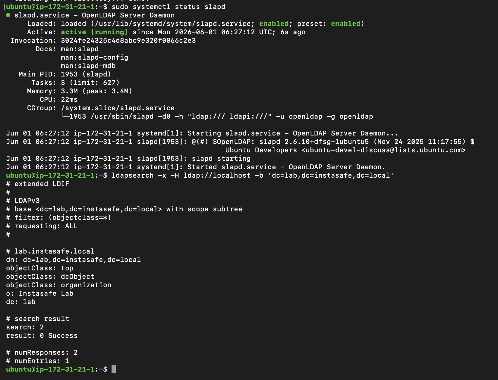
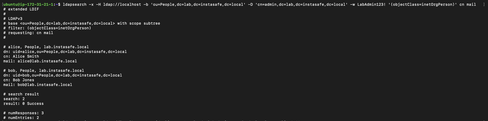
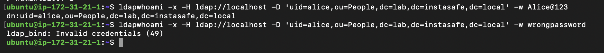

# Lab 2.1 – OpenLDAP User Directory and Authentication Validation

## Objective

The objective of this lab was to install and configure OpenLDAP, create users and organizational units using LDIF, perform LDAP searches, validate user authentication through LDAP bind operations, and understand how these concepts map to InstaSafe Active Directory (AD) synchronization.

---

## Environment Details

- Operating System: Ubuntu Server
- LDAP Server: OpenLDAP (slapd)
- Domain: `lab.instasafe.local`
- Base DN: `dc=lab,dc=instasafe,dc=local`
- Organization: InstaSafe Lab

---

## Step 1: OpenLDAP Installation and Verification

OpenLDAP (`slapd`) and LDAP utilities were installed and configured. The LDAP directory structure was verified using:

```bash
ldapsearch -x -H ldap://localhost -b 'dc=lab,dc=instasafe,dc=local'
```

### Evidence

**Screenshot:** 

This screenshot shows that the LDAP server is running and the base directory structure is accessible.

---

## Step 2: Create Users and Organizational Units

The following organizational units were created:

- People
- Groups

The following users were added:

| Username | Full Name | Email |
|----------|-----------|--------|
| alice | Alice Smith | alice@lab.instasafe.local |
| bob | Bob Jones | bob@lab.instasafe.local |

### LDIF Import Result

```text
adding new entry "ou=People,dc=lab,dc=instasafe,dc=local"

adding new entry "ou=Groups,dc=lab,dc=instasafe,dc=local"

adding new entry "uid=alice,ou=People,dc=lab,dc=instasafe,dc=local"

adding new entry "uid=bob,ou=People,dc=lab,dc=instasafe,dc=local"
```

The successful messages confirm that all entries were added to the LDAP directory.

---

## Step 3: LDAP Search Validation

The following query was executed to retrieve all users:

```bash
ldapsearch -x -H ldap://localhost \
-b 'ou=People,dc=lab,dc=instasafe,dc=local' \
-D 'cn=admin,dc=lab,dc=instasafe,dc=local' \
-w LabAdmin123! \
'(objectClass=inetOrgPerson)' cn mail
```

### Result

```text
dn: uid=alice,ou=People,dc=lab,dc=instasafe,dc=local
cn: Alice Smith
mail: alice@lab.instasafe.local

dn: uid=bob,ou=People,dc=lab,dc=instasafe,dc=local
cn: Bob Jones
mail: bob@lab.instasafe.local

result: 0 Success
```

### Evidence

**Screenshot:** 

The output confirms that both users exist in the directory and their attributes can be retrieved successfully.

---

## Step 4: LDAP Bind Authentication Test

### Successful Authentication

Command:

```bash
ldapwhoami -x -H ldap://localhost \
-D 'uid=alice,ou=People,dc=lab,dc=instasafe,dc=local' \
-w Alice@123
```

Output:

```text
dn:uid=alice,ou=People,dc=lab,dc=instasafe,dc=local
```

This confirms that Alice successfully authenticated against the LDAP server.

### Failed Authentication

Command:

```bash
ldapwhoami -x -H ldap://localhost \
-D 'uid=alice,ou=People,dc=lab,dc=instasafe,dc=local' \
-w wrongpassword
```

Output:

```text
ldap_bind: Invalid credentials (49)
```

This confirms that authentication fails when an incorrect password is supplied.

### Evidence

**Screenshot:** 

The screenshot contains both successful and failed authentication attempts.

---

## Mapping LDAP Concepts to InstaSafe AD Sync

| LDAP Concept | OpenLDAP Example | InstaSafe AD Sync Equivalent |
|--------------|------------------|------------------------------|
| Base DN | `dc=lab,dc=instasafe,dc=local` | Root location where InstaSafe searches for users |
| Bind DN | `cn=admin,dc=lab,dc=instasafe,dc=local` | Service account used by InstaSafe to connect to AD |
| User DN | `uid=alice,ou=People,dc=lab,dc=instasafe,dc=local` | User object location in Active Directory |
| User Lookup | Search using `mail`, `uid`, or `cn` | InstaSafe searches users during sync/login |
| LDAP Search | `ldapsearch` | AD synchronization process |
| LDAP Bind | `ldapwhoami` | User authentication during login |
| Attributes | `cn`, `uid`, `mail` | User profile attributes synced into InstaSafe |

---

## Understanding LDAP Error 49

### Error

```text
ldap_bind: Invalid credentials (49)
```

### Meaning

Error code **49** indicates that the LDAP server rejected the authentication request because the supplied credentials were invalid.

Common causes include:

- Incorrect password
- Incorrect username
- Wrong Bind DN
- Disabled account
- Locked account
- Expired password

---

## What Does a Support Engineer Do When Error 49 Appears?

When Error 49 is observed in an AD Sync or authentication log, a support engineer typically performs the following checks:

1. Verify that the username is correct.
2. Confirm that the password being used is valid.
3. Check whether the Bind DN configured in the application is correct.
4. Verify that the user account exists in Active Directory.
5. Check whether the account is locked, disabled, or expired.
6. Test authentication manually using LDAP tools such as `ldapwhoami` and `ldapsearch`.
7. Review Active Directory logs and application logs for additional details.
8. Reset the password if necessary and retest authentication.

---

## Findings

- OpenLDAP was installed and configured successfully.
- The LDAP directory structure was accessible and functional.
- Organizational units and user entries were successfully created using LDIF.
- LDAP search operations correctly returned user information.
- LDAP bind authentication succeeded for valid credentials.
- LDAP bind authentication failed with Error 49 when invalid credentials were supplied.
- The lab demonstrated the same core concepts used by InstaSafe during Active Directory synchronization and user authentication.

---

## Screenshots Submitted

| Screenshot | Description |
|------------|-------------|
| `dir.png` | LDAP directory structure verification |
| `search.png` | LDAP search showing Alice and Bob |
| `whoami.png` | Successful bind and Error 49 authentication failure |

---

## Conclusion

This lab successfully demonstrated OpenLDAP installation, directory management, user creation, LDAP searches, and authentication validation. The exercises provided practical understanding of how InstaSafe integrates with LDAP/Active Directory for user synchronization and login authentication. The successful bind operations and Error 49 troubleshooting scenario closely mirror real-world support and identity-management workflows.
