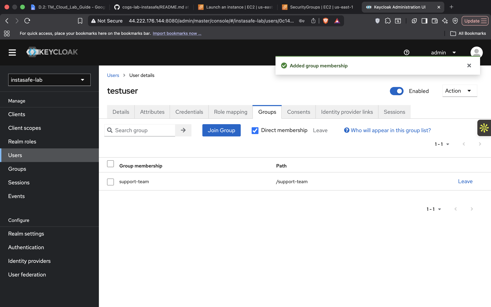

# Lab 2.2 – Keycloak SAML SSO Configuration

## Objective

Deploy Keycloak as an Identity Provider (IdP), create users and groups, configure a SAML client, and validate a basic SAML authentication workflow.

---

# Environment

- Platform: AWS EC2
- Operating System: Ubuntu
- Keycloak Version: 23.0.0
- Public IP: 44.222.176.144

---

# Evidence

## 1. Keycloak Realm, User and SAML Client





The realm **instasafe-lab** was created successfully.

Configured resources:

- Realm: `instasafe-lab`
- User: `testuser`
- Group: `support-team`
- SAML Client: `InstaSafe SP Simulation`

---

## 2. SAML Client Configuration


### Client Details

| Setting | Value |
|----------|----------|
| Client Type | SAML |
| Client ID | https://sp.instasafe.local/saml |
| Valid Redirect URI | http://44.222.176.144:9090/saml/callback |
| Master SAML Processing URL | http://44.222.176.144:9090/saml/callback |

---

## 3. Attribute Mappers


### Email Mapper

Purpose:

Passes the user's email address inside the SAML assertion.

Configuration:

- Mapper Type: User Property
- User Property: email
- SAML Attribute Name: email

### Groups Mapper

Purpose:

Passes Keycloak group membership information to the Service Provider.

Configuration:

- Mapper Type: Group List
- SAML Attribute Name: groups

---

## 4. IdP Metadata XML
```xml
<md:EntityDescriptor xmlns="urn:oasis:names:tc:SAML:2.0:metadata" xmlns:md="urn:oasis:names:tc:SAML:2.0:metadata" xmlns:saml="urn:oasis:names:tc:SAML:2.0:assertion" xmlns:ds="http://www.w3.org/2000/09/xmldsig#" entityID="http://44.222.176.144:8080/realms/instasafe-lab">
<md:IDPSSODescriptor WantAuthnRequestsSigned="true" protocolSupportEnumeration="urn:oasis:names:tc:SAML:2.0:protocol">
<md:KeyDescriptor use="signing">
<ds:KeyInfo>
<ds:KeyName>N3BGbiFwWCkayZNjSkqUWfXtVE9rD-if23KXEXof4q0</ds:KeyName>
<ds:X509Data>
<ds:X509Certificate>MIICqTCCAZECBgGesQKeJTANBgkqhkiG9w0BAQsFADAYMRYwFAYDVQQDDA1pbnN0YXNhZmUtbGFiMB4XDTI2MDYxMDEwMDgxOVoXDTM2MDYxMDEwMDk1OVowGDEWMBQGA1UEAwwNaW5zdGFzYWZlLWxhYjCCASIwDQYJKoZIhvcNAQEBBQADggEPADCCAQoCggEBALSjqq9GpjdHvSVqStIAAEMFGkNNgDzp5ySSRtLWRFaPMVBH+ZAmeRpuc0Z/2+sHYK7BLV7DRCMpIWU3a4peX53bjU8UA48diZBFXk+riPlUSrQyXhN1xUNjXx64Xhccar8J8DLHoO/1+BlbWwY3PFXW/pbE783sl0TgGKxBvXWADS5p/NcV8WtpApciMMr2Cgv9MUy7u+SElNupJDHqL86J1hmspB7vKm6HbGOYoSTkJkV6ygnNVYslOfihhB81qpf1zKh/YdeRqkdKTCYVV2LhM09SCrxUowYXRZUEBOxMydW5YSoLpL0flrf6ORlkqgYDiLiZuSHyq9AglW4KdU8CAwEAATANBgkqhkiG9w0BAQsFAAOCAQEAZgDL1NxacPHyY4fhwDLALZCjGA//9aoW2h0rVwfn4WkMbhBs1WVV9Qg9hsrr1KILukopPrMvoZbyRDS6ieyilip2UIjIIwq/kvYpGBTptIfhOBlrz/UCKscFeYql3vYIMmFYg5SXvCgJ4Ol02Wj82BSPBbe803JMllZ3HwcZzxP8n4kfT+13ulAPB3U6waWbkehalDwNssc9+MUAiWjOJGm9SuT61Ny+dIyBVWqeNiIBAtGJGSKQXykEl6lOhPFrSHF4TCeW83Q0viLqSGQUdOiipS0xHi2zKAtoeTVbO5uUp+qOWGuN76RqRX/M/OxH66ZadhNcVf2sziG9uvMWMA==</ds:X509Certificate>
</ds:X509Data>
</ds:KeyInfo>
</md:KeyDescriptor>
<md:ArtifactResolutionService Binding="urn:oasis:names:tc:SAML:2.0:bindings:SOAP" Location="http://44.222.176.144:8080/realms/instasafe-lab/protocol/saml/resolve" index="0"/>
<md:SingleLogoutService Binding="urn:oasis:names:tc:SAML:2.0:bindings:HTTP-POST" Location="http://44.222.176.144:8080/realms/instasafe-lab/protocol/saml"/>
<md:SingleLogoutService Binding="urn:oasis:names:tc:SAML:2.0:bindings:HTTP-Redirect" Location="http://44.222.176.144:8080/realms/instasafe-lab/protocol/saml"/>
<md:SingleLogoutService Binding="urn:oasis:names:tc:SAML:2.0:bindings:HTTP-Artifact" Location="http://44.222.176.144:8080/realms/instasafe-lab/protocol/saml"/>
<md:SingleLogoutService Binding="urn:oasis:names:tc:SAML:2.0:bindings:SOAP" Location="http://44.222.176.144:8080/realms/instasafe-lab/protocol/saml"/>
<md:NameIDFormat>urn:oasis:names:tc:SAML:2.0:nameid-format:persistent</md:NameIDFormat>
<md:NameIDFormat>urn:oasis:names:tc:SAML:2.0:nameid-format:transient</md:NameIDFormat>
<md:NameIDFormat>urn:oasis:names:tc:SAML:1.1:nameid-format:unspecified</md:NameIDFormat>
<md:NameIDFormat>urn:oasis:names:tc:SAML:1.1:nameid-format:emailAddress</md:NameIDFormat>
<md:SingleSignOnService Binding="urn:oasis:names:tc:SAML:2.0:bindings:HTTP-POST" Location="http://44.222.176.144:8080/realms/instasafe-lab/protocol/saml"/>
<md:SingleSignOnService Binding="urn:oasis:names:tc:SAML:2.0:bindings:HTTP-Redirect" Location="http://44.222.176.144:8080/realms/instasafe-lab/protocol/saml"/>
<md:SingleSignOnService Binding="urn:oasis:names:tc:SAML:2.0:bindings:SOAP" Location="http://44.222.176.144:8080/realms/instasafe-lab/protocol/saml"/>
<md:SingleSignOnService Binding="urn:oasis:names:tc:SAML:2.0:bindings:HTTP-Artifact" Location="http://44.222.176.144:8080/realms/instasafe-lab/protocol/saml"/>
</md:IDPSSODescriptor>
</md:EntityDescriptor>

Metadata downloaded from:

```text
http://44.222.176.144:8080/realms/instasafe-lab/protocol/saml/descriptor
```

### Entity ID

```xml
entityID="http://44.222.176.144:8080/realms/instasafe-lab"
```

### Single Sign-On Endpoint

```xml
http://44.222.176.144:8080/realms/instasafe-lab/protocol/saml
```

### Metadata Purpose

The metadata XML contains:

- Identity Provider Entity ID
- SAML Single Sign-On endpoints
- Single Logout endpoints
- Signing certificate
- Supported NameID formats

This metadata would normally be provided to a Service Provider during SSO onboarding.

---

# User and Group Configuration

## User

| Attribute | Value |
|------------|------------|
| Username | testuser |
| Email | testuser@instasafe.local |
| Password | TestUser@123 |

## Group

```text
support-team
```

User `testuser` was added to the `support-team` group.

---

# SAML Authentication Flow

A lightweight Flask-based Service Provider simulation was deployed on port 9090.

### Flow

1. User accesses:

```text
http://44.222.176.144:9090/saml/login
```

2. Service Provider redirects the user to Keycloak.

3. User authenticates using:

```text
Username: testuser
Password: TestUser@123
```

4. Keycloak generates a SAML Assertion.

5. The assertion is returned to:

```text
http://44.222.176.144:9090/saml/callback
```

6. User attributes such as email and group membership are included in the SAML response.

---

# Verification

The following items were successfully verified:

- Keycloak admin console accessible
- Realm created successfully
- User account created
- Group created
- User assigned to group
- SAML client configured
- Email attribute mapper configured
- Group attribute mapper configured
- IdP metadata downloaded
- SAML authentication flow tested

---

# Troubleshooting Question

## If a customer reports that SSO users receive an "Attribute Error", what would you check first?

The first item to verify is the SAML Attribute Mapper configuration.

### Menu Path

```text
Clients
→ InstaSafe SP Simulation
→ Client Scopes / Mappers
```

### Items to Verify

1. Email mapper exists.
2. Groups mapper exists.
3. Attribute names match the Service Provider requirements.
4. User profile contains values for mapped attributes.
5. Group membership is correctly assigned.
6. Mapper type is correctly configured.

### Most Common Cause

The most common cause of SAML attribute errors is a missing or incorrectly configured mapper, resulting in the Service Provider receiving an unexpected attribute name or no attribute value at all.

---

# Conclusion

The Keycloak Identity Provider was successfully deployed and configured. Users, groups, SAML clients, and attribute mappers were created successfully. Metadata was generated and exported, and a SAML authentication workflow was validated using a simulated Service Provider.
