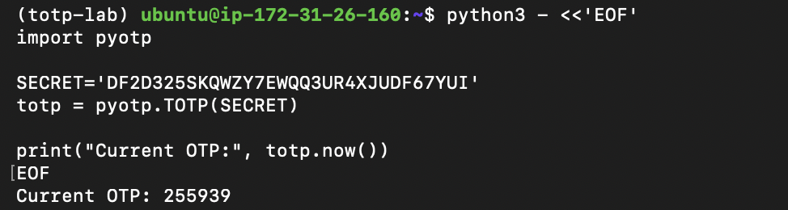
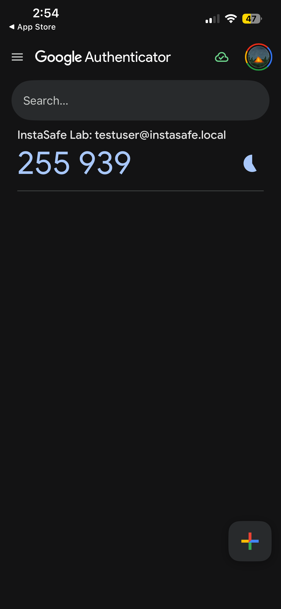
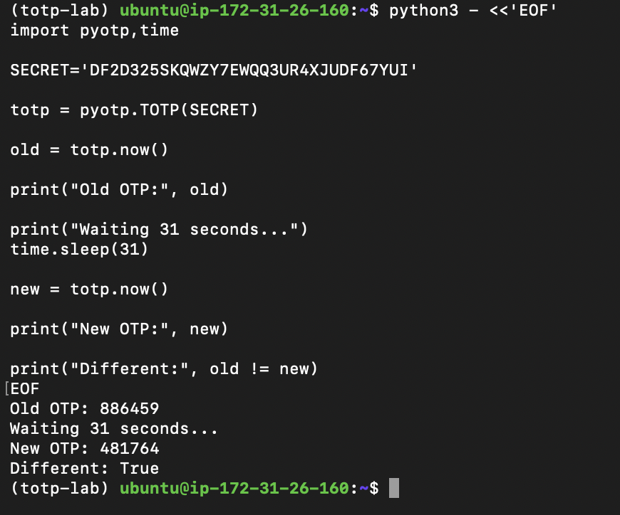

# Lab 2.3 – Time-based One-Time Password (TOTP)

## Objective

Build a TOTP (Time-based One-Time Password) system using Python and understand:

- How Google Authenticator and similar authenticator applications work
- How TOTP is generated and verified
- Why TOTP is more secure than SMS OTP
- Common causes of TOTP failures in enterprise environments

---

## Environment

- Platform: AWS EC2 Ubuntu Instance
- Operating System: Ubuntu Linux
- Python Environment: Virtual Environment (venv)
- Libraries Used:
  - pyotp
  - qrcode
  - pillow

---

## Step 1 – Install Dependencies

Created a Python virtual environment and installed the required packages.

```bash
python3 -m venv ~/totp-lab
source ~/totp-lab/bin/activate

pip install pyotp qrcode pillow
```

Verification:

```bash
python3 -c "import pyotp,qrcode,PIL; print('Dependencies OK')"
```

Output:

```text
Dependencies OK
```

---

## Step 2 – Generate TOTP Secret and QR Code

Python script used:

```python
import pyotp, qrcode, time

secret = pyotp.random_base32()
totp = pyotp.TOTP(secret)

uri = totp.provisioning_uri(
    name='testuser@instasafe.local',
    issuer_name='InstaSafe Lab'
)

qr = qrcode.make(uri)
qr.save('/tmp/totp_qr.png')

print("Current OTP:", totp.now())
```

Generated Secret:

```text
DF2D325SKQWZY7EWQQ3UR4XJUDF67YUI
```

### QR Code Generated


**Evidence Screenshot:** `./images/totp_qr.png`

---

## Step 3 – Scan QR Code with Google Authenticator

The generated QR code was scanned using Google Authenticator.

The authenticator application successfully imported the account:

```text
InstaSafe Lab
testuser@instasafe.local
```

A 6-digit TOTP code was generated on the mobile device.

This demonstrates interoperability between the Python implementation and the RFC 6238 standard used by authenticator applications.

---

## Step 4 – Verify TOTP

Verification script:

```python
import pyotp

SECRET='DF2D325SKQWZY7EWQQ3UR4XJUDF67YUI'

totp = pyotp.TOTP(SECRET)

print("Current OTP:", totp.now())
```

Output:

```text
Current OTP: 255939
```

The OTP displayed in Google Authenticator matched the OTP generated by the Python script.

### Evidence

Terminal Output:



Authenticator Match:



Result:

```text
OTP Match: SUCCESS
```

This proves that both the client (Google Authenticator) and server (Python verification script) generate the same OTP independently using only:

- Shared secret
- Current time

No network communication is required.

---

## Step 5 – Demonstrate OTP Rotation

TOTP rotates every 30 seconds.

Verification script:

```python
import pyotp,time

SECRET='DF2D325SKQWZY7EWQQ3UR4XJUDF67YUI'

totp = pyotp.TOTP(SECRET)

old = totp.now()

print("Old OTP:", old)

time.sleep(31)

new = totp.now()

print("New OTP:", new)

print("Different:", old != new)
```

Output:

```text
Old OTP: 886459
New OTP: 481764
Different: True
```

### Evidence



Observation:

- Original OTP expired
- New OTP was generated after 31 seconds
- The values were different

This confirms that TOTP changes automatically every 30 seconds.

---

# How TOTP Works

TOTP is defined by RFC 6238.

The algorithm combines:

1. A shared secret key
2. Current Unix timestamp
3. HMAC-SHA1 hashing

Both the server and authenticator application calculate the OTP independently.

Workflow:

```text
Shared Secret
      +
Current Time
      ↓
 HMAC-SHA1
      ↓
 Dynamic Truncation
      ↓
 6-Digit OTP
```

Because both sides possess the same secret and time reference, they generate identical codes.

---

# Why TOTP Is More Secure Than SMS OTP

| SMS OTP | TOTP |
|----------|------|
| Requires mobile network | Works offline |
| Vulnerable to SIM swapping | Not vulnerable to SIM swapping |
| Vulnerable to SMS interception | No SMS transmission |
| Delivery delays possible | Instant generation |
| Depends on telecom provider | Depends only on secret and time |
| Can be phished through SMS forwarding | More resistant to interception |

Advantages of TOTP:

- Offline operation
- No telecom dependency
- Reduced attack surface
- Short validity period
- Standardized and widely adopted

---

# TOTP Failure Analysis in Enterprise Environments

## Root Cause 1: Device Clock Drift

### Description

TOTP depends on accurate time synchronization.

If the user's phone clock differs significantly from the authentication server, OTP values will not match.

### Diagnostic Step

Check whether the phone's date and time settings are configured to:

```text
Set Automatically
```

and verify NTP synchronization on the server.

---

## Root Cause 2: Incorrect Secret Enrollment

### Description

If the QR code is scanned incorrectly or the wrong secret is registered on the server, generated OTPs will never match.

### Diagnostic Step

Re-enroll the authenticator application by generating and scanning a new QR code.

---

## Root Cause 3: Expired OTP Entry

### Description

Users may enter a code that is about to expire.

Since TOTP rotates every 30 seconds, a code can become invalid before verification.

### Diagnostic Step

Observe the countdown timer in the authenticator app and retry using a freshly generated code.

---

# Key Findings

- Successfully generated a TOTP secret.
- Successfully created a QR code.
- Successfully scanned the QR code with Google Authenticator.
- Verified that Python and Google Authenticator generated identical OTP values.
- Demonstrated OTP rotation after 31 seconds.
- Confirmed that TOTP operates without network communication.
- Identified common causes of TOTP failures in enterprise environments.

---

# Conclusion

This lab successfully demonstrated the implementation and verification of a Time-based One-Time Password (TOTP) system using Python. The generated QR code was imported into Google Authenticator, and both the authenticator application and Python script produced identical OTP values. The experiment also verified the 30-second rotation behavior of TOTP and analyzed common enterprise failure scenarios such as clock drift, enrollment issues, and expired codes. The exercise provided practical insight into how modern multi-factor authentication systems function and why TOTP offers stronger security than traditional SMS-based OTP mechanisms.
