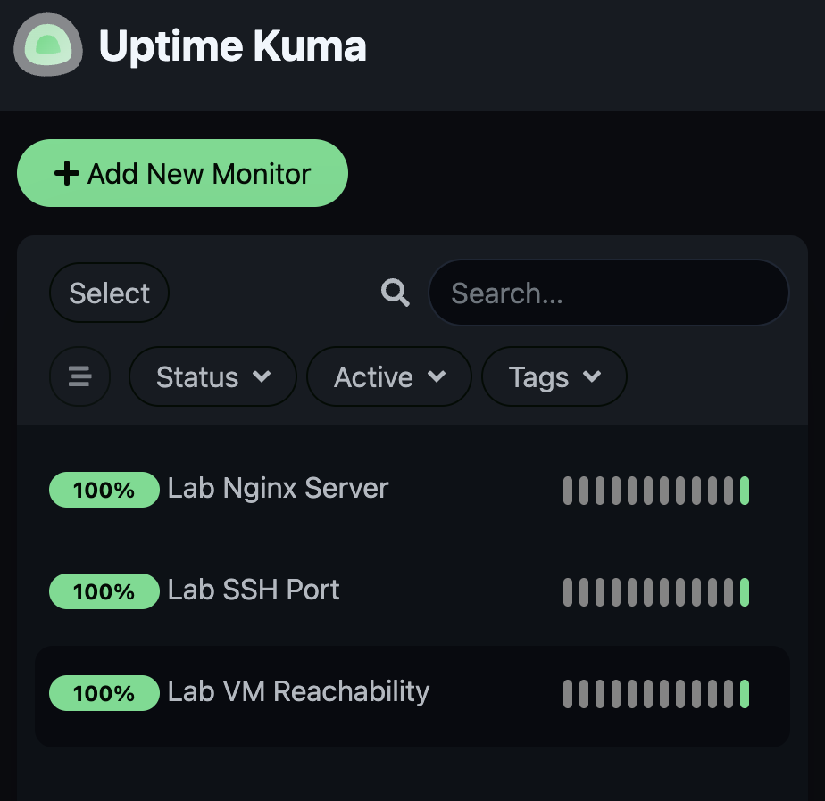
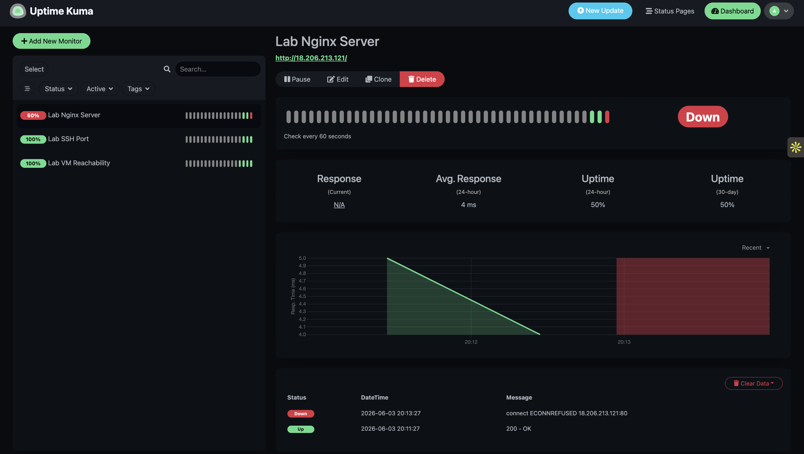
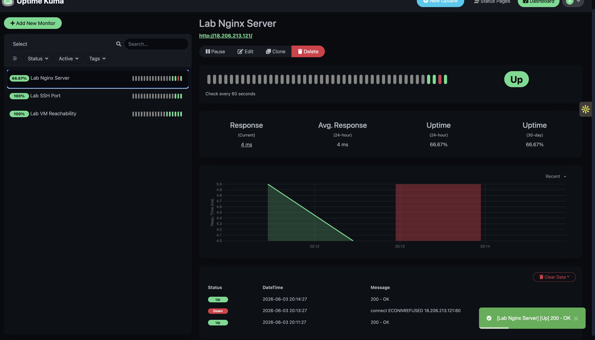

# Lab 3.1 – Infrastructure Monitoring with Uptime Kuma

## Objective

Deploy and configure Uptime Kuma as a lightweight monitoring platform, create multiple monitor types, simulate a service outage, observe incident detection and recovery, and relate the monitor types to enterprise monitoring solutions such as Site24x7.

---

## Environment

### Monitoring Server (VM1)
- Public IP: `32.192.86.51`
- Service: Uptime Kuma
- Port: `3001`

### Monitored Server (VM2)
- Public IP: `18.206.213.121`
- Service: Nginx Web Server
- SSH Port: `22`

---

## Step 1 – Deploy Uptime Kuma

Pulled and started the Uptime Kuma Docker container:

```bash
docker pull louislam/uptime-kuma:1

docker run -d --restart=always --name uptime-kuma \
-p 3001:3001 \
-v uptime-kuma:/app/data \
louislam/uptime-kuma:1
```

Verified container status:

```bash
sudo docker ps
```

Output:

```text
CONTAINER ID   IMAGE                    COMMAND                  CREATED          STATUS                    PORTS                                         NAMES
330efb3efe9b   louislam/uptime-kuma:1   "/usr/bin/dumb-init …"   43 minutes ago   Up 43 minutes (healthy)   0.0.0.0:3001->3001/tcp, [::]:3001->3001/tcp   uptime-kuma
```

---

## Step 2 – Create Monitors

Three monitor types were configured in Uptime Kuma.

### Monitor 1 – HTTP Monitor

| Parameter | Value |
|------------|---------|
| Name | Lab Nginx Server |
| Type | HTTP(S) |
| URL | http://18.206.213.121 |
| Interval | 60 seconds |
| Retries | 3 |

### Monitor 2 – TCP Port Monitor

| Parameter | Value |
|------------|---------|
| Name | Lab SSH Port |
| Type | TCP Port |
| Host | 18.206.213.121 |
| Port | 22 |
| Interval | 60 seconds |

### Monitor 3 – Ping Monitor

| Parameter | Value |
|------------|---------|
| Name | Lab VM Reachability |
| Type | Ping |
| Host | 18.206.213.121 |
| Interval | 30 seconds |

### Dashboard Status

All three monitors successfully reported healthy status.



---

## Step 3 – Simulate Failure

To test alerting functionality, the Nginx service on VM2 was stopped.

```bash
sudo systemctl stop nginx
```

Uptime Kuma detected the outage during the next monitoring cycle.

Observed behavior:

- HTTP monitor changed from GREEN to RED
- Incident entry created in timeline
- Service marked unavailable

### Failure Detection Screenshot



---

## Step 4 – Service Recovery

The Nginx service was restarted.

```bash
sudo systemctl start nginx
```

Verification:

```bash
systemctl status nginx --no-pager
```

Output:

```text
Active: active (running)
```

Uptime Kuma automatically detected recovery and updated monitor status back to GREEN.

### Recovery Screenshot



---

## Nginx Verification

Connectivity test from VM2:

```bash
curl http://18.206.213.121
```

Returned the default Nginx welcome page:

```html
<h1>Welcome to nginx!</h1>
```

This confirmed that the HTTP monitor had a valid service endpoint.

---

## Monitor Type Mapping: Uptime Kuma vs Site24x7

| Uptime Kuma Monitor | Equivalent Site24x7 Monitor | Purpose |
|--------------------|----------------------------|---------|
| HTTP(S) Monitor | Website Monitor | Verify web application availability and response |
| TCP Port Monitor | Port Monitor | Verify specific service ports are accepting connections |
| Ping Monitor | Server Availability Monitor | Verify network reachability and host availability |

---

## Which Monitor Type Should Be Used for an InstaSafe Gateway?

For monitoring an InstaSafe Gateway, a combination of monitor types should be used:

### Primary Monitor
**TCP Port Monitor**

Reason:
- Confirms gateway services are accepting connections.
- Detects service-level failures even when the server itself is reachable.

### Secondary Monitor
**Ping Monitor**

Reason:
- Detects complete network outages.
- Confirms gateway reachability.

### Additional Enterprise Monitoring
**HTTP(S) Monitor**

Reason:
- Useful when the gateway exposes a management portal or web interface.
- Validates application-level availability.

Therefore, the most important monitor for an InstaSafe Gateway is the **TCP Port Monitor**, supplemented by Ping and HTTP monitoring for comprehensive coverage.

---

## Findings

1. Uptime Kuma was successfully deployed using Docker.
2. HTTP, TCP Port, and Ping monitor types were configured.
3. Service outages were detected automatically.
4. Incident timelines accurately recorded downtime and recovery.
5. Monitoring concepts directly map to enterprise platforms such as Site24x7.
6. Multi-layer monitoring provides better visibility into infrastructure health.

---

## Evidence

### Screenshot 1 – Healthy Dashboard

`./images/kuma_green_dashboard.png`

### Screenshot 2 – Failure Detection

`./images/kuma_red_alert.png`

### Screenshot 3 – Recovery Status

`./images/kuma_recovery.png`

---

## Conclusion

The lab demonstrated the deployment of a production-style monitoring solution using Uptime Kuma. Multiple monitoring methodologies were tested, outage detection was validated, and recovery events were successfully recorded. The exercise provided practical experience with infrastructure monitoring concepts commonly used in enterprise environments such as Site24x7.
