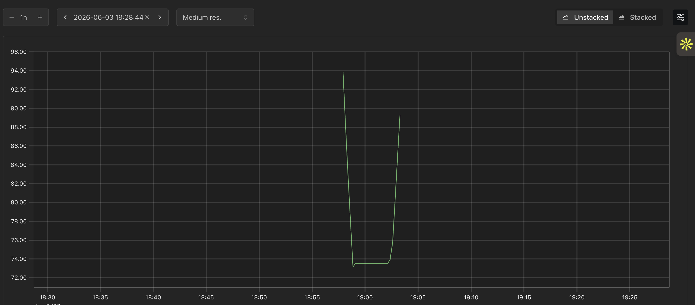
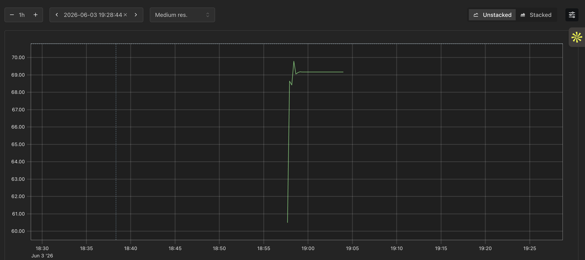
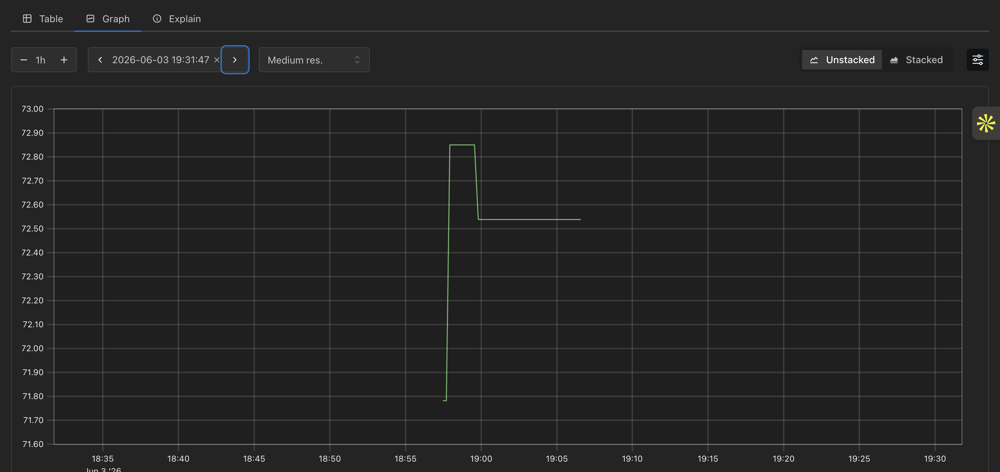
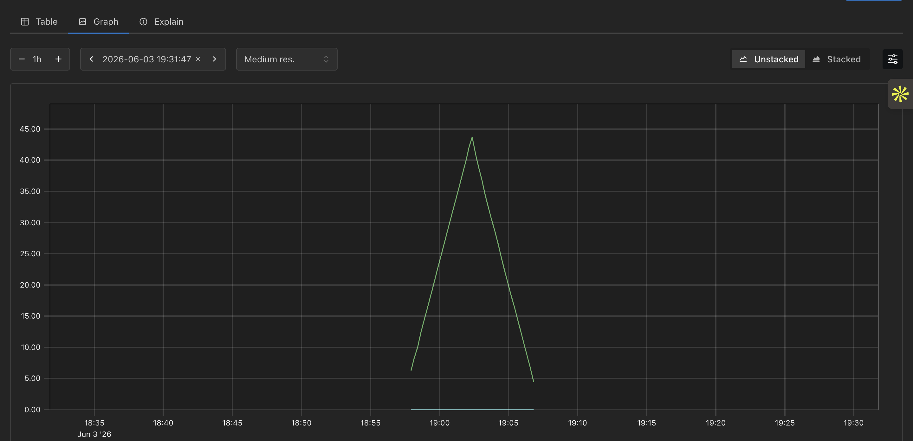
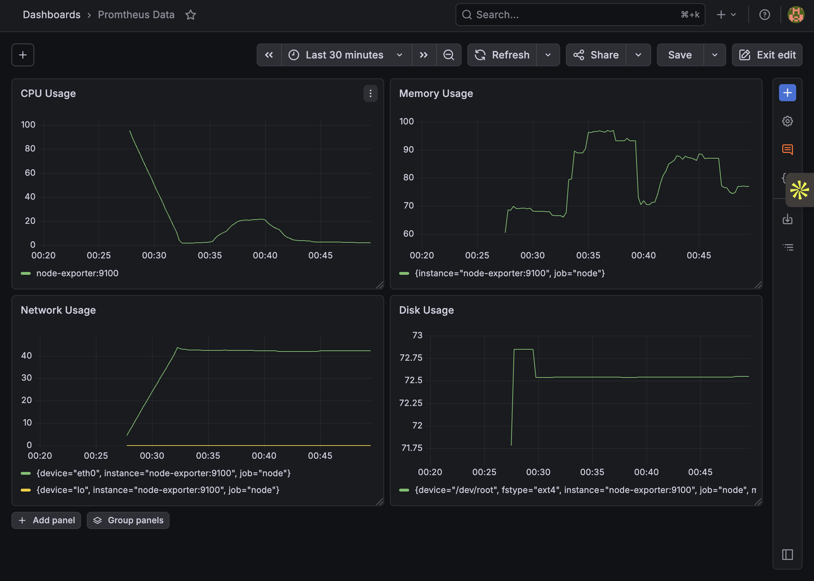
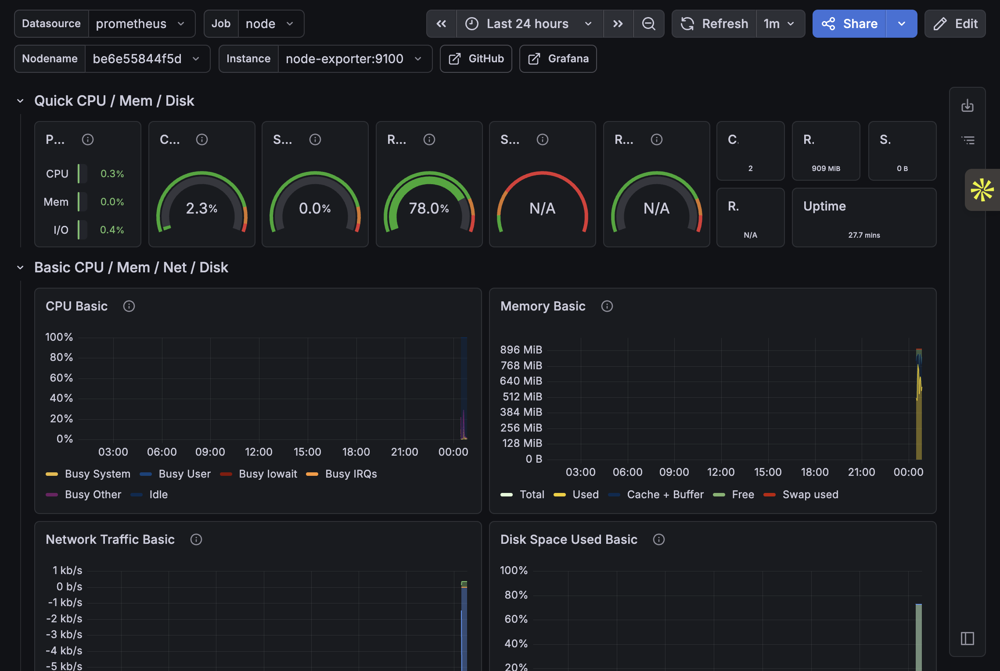

# Lab 3.2 — Prometheus + Grafana — Build Your Own APM Dashboard


---

## Objective

The objective of this lab was to deploy a monitoring stack using Prometheus, Grafana, and Node Exporter, collect infrastructure metrics from a Linux server, visualize them through Grafana dashboards, and understand how these tools compare with modern observability platforms such as SigNoz.

---

## Environment

- AWS EC2 Ubuntu Instance
- Docker
- Docker Compose
- Prometheus
- Grafana
- Node Exporter

---

## Step 1 — Deploy Prometheus, Grafana and Node Exporter

Created a Docker Compose stack consisting of:

- Prometheus for metrics collection
- Grafana for visualization
- Node Exporter for host metrics

Verified all services were running successfully.

### Evidence


---

## Step 2 — Explore Prometheus Metrics

Opened the Prometheus Expression Browser and executed infrastructure monitoring queries.

### CPU Usage

Query:

```promql
100 - (avg by(instance) (rate(node_cpu_seconds_total{mode='idle'}[5m])) * 100)
```

Evidence:



---

### Memory Usage

Query:

```promql
(1 - node_memory_MemAvailable_bytes / node_memory_MemTotal_bytes) * 100
```

Evidence:



---

### Disk Usage

Query:

```promql
100 * (
  1 -
  (
    node_filesystem_avail_bytes{mountpoint="/etc/hosts"}
    /
    node_filesystem_size_bytes{mountpoint="/etc/hosts"}
  )
)
```

Evidence:



---

### Network Traffic

Query:

```promql
rate(node_network_receive_bytes_total[5m])
```

Evidence:



---

## Step 3 — Build a Grafana Dashboard

Configured Prometheus as a Grafana data source and created a custom monitoring dashboard containing:

- CPU Usage Panel
- Memory Usage Panel
- Disk Usage Panel
- Network Traffic Panel

### Evidence



---

## Step 4 — Import Professional Node Exporter Dashboard

Imported the official Node Exporter Full dashboard using Dashboard ID **1860**.

This dashboard provides:

- CPU statistics
- Memory statistics
- Disk statistics
- Network statistics
- Filesystem metrics
- System load metrics

### Evidence



---

# Findings

## Prometheus vs Grafana vs SigNoz

### Prometheus

Prometheus is an open-source monitoring and alerting system designed to collect and store time-series metrics.

Key features:

- Metrics collection
- Time-series database
- PromQL query language
- Alert generation

Examples of monitored metrics:

- CPU utilization
- Memory utilization
- Disk usage
- Network traffic

---

### Grafana

Grafana is a visualization platform that connects to Prometheus and other data sources.

Key features:

- Dashboards
- Graphs and visualizations
- Alerting
- Data exploration

Grafana does not collect metrics itself; it visualizes data collected by Prometheus.

---

### SigNoz

SigNoz is a full-stack observability platform.

In addition to metrics, SigNoz provides:

- Distributed tracing
- Application Performance Monitoring (APM)
- Log management
- Service dependency mapping
- Request latency analysis
- Error tracking

---

## What Prometheus/Grafana Shows vs What SigNoz Shows

### Prometheus + Grafana

Primarily focused on infrastructure and system-level monitoring:

- CPU usage
- Memory consumption
- Disk utilization
- Network throughput
- Host performance

Useful for determining whether infrastructure resources are healthy.

---

### SigNoz

Provides application-level observability:

- API latency
- Request traces
- Database query performance
- Service-to-service communication
- Error rates
- Application bottlenecks

Useful for understanding why an application is slow or failing.

---

## During a P1 Incident

### When to Use Prometheus + Grafana

Use Prometheus and Grafana when investigating:

- CPU spikes
- Memory exhaustion
- Disk saturation
- Network bottlenecks
- Infrastructure failures
- Capacity issues

These tools help answer:

> Is the server healthy?

---

### When to Use SigNoz

Use SigNoz when investigating:

- Slow API requests
- Microservice communication issues
- Application crashes
- High latency transactions
- Database performance problems
- User-facing service degradation

These tools help answer:

> Why is the application failing?

---

## Conclusion

Prometheus and Grafana together provide a powerful open-source monitoring stack for collecting and visualizing infrastructure metrics. They are excellent for server and resource monitoring.

SigNoz extends observability beyond metrics by incorporating traces, logs, and application performance insights, making it more suitable for diagnosing complex application-level incidents.

This lab demonstrated the complete workflow of deploying a monitoring stack, collecting metrics, creating dashboards, and understanding the role of observability tools during real-world production incidents.
