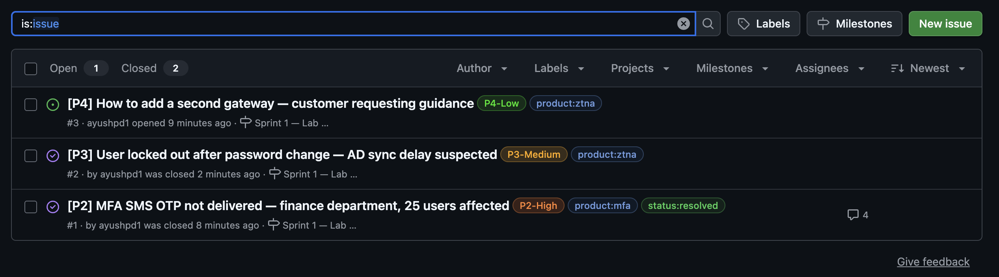
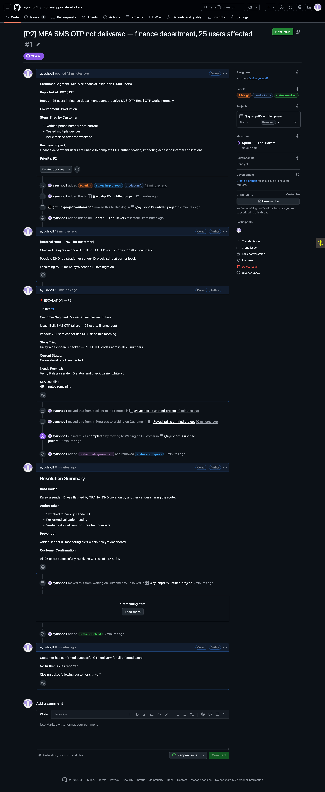
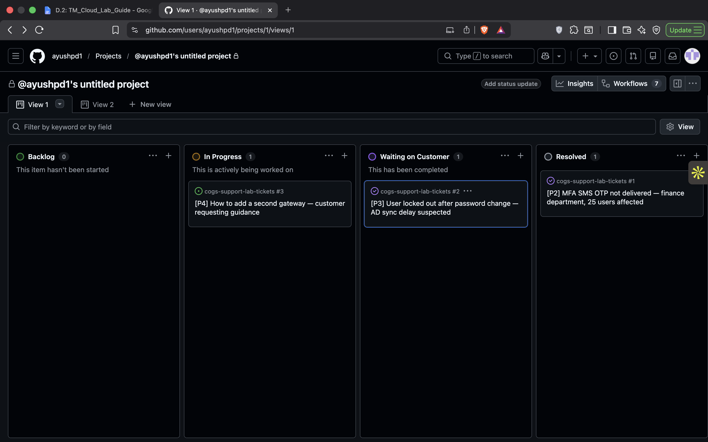

# Lab 4 — Support Ticket Lifecycle Simulation Using GitHub

## Objective

The objective of this lab was to simulate a real-world SaaS/Product Support workflow using GitHub Issues, Labels, Milestones, and Project Boards. The exercise covered ticket creation, prioritization, escalation, investigation, resolution, and closure processes commonly followed by Technical Support Engineers and Customer Success teams.

---

## Environment

- GitHub Repository
- GitHub Issues
- GitHub Labels
- GitHub Milestones
- GitHub Projects (Board View)

Repository Created:

`cogs-support-lab-tickets`

---

# Step 1 — Repository Setup

A GitHub repository was created to simulate a support operations environment.

The following labels were configured:

| Category | Labels |
|-----------|---------|
| Priority | P1-Critical, P2-High, P3-Medium, P4-Low |
| Status | status:in-progress, status:waiting-on-customer, status:resolved |
| Product | product:ztna, product:mfa, product:sso |

A milestone was created:

- Sprint 1 — Lab Tickets

A project board was created with the following workflow columns:

- Backlog
- In Progress
- Waiting on Customer
- Resolved
- Closed

### Evidence

---

# Step 2 — Ticket Creation

Three mock support tickets were created to represent different support scenarios.

## Ticket #1 — MFA SMS OTP Failure

**Priority:** P2-High

**Product:** MFA

**Issue Summary:**

25 users from the finance department of a mid-sized financial institution were unable to receive SMS OTPs for MFA authentication. Email OTP continued to function correctly.

### Initial Investigation

An internal investigation was conducted and documented within the ticket.

Key findings:

- Kaleyra dashboard showed REJECTED status codes.
- Phone numbers were verified.
- Issue appeared after the weekend.
- Possible carrier-level or sender ID issue suspected.

---

## Ticket #2 — User Locked Out After Password Change

**Priority:** P3-Medium

**Product:** ZTNA

**Issue Summary:**

A single enterprise user was unable to authenticate after changing their Active Directory password.

### Investigation

- Password reset confirmed.
- User could log directly into Active Directory.
- Other users unaffected.
- Suspected AD synchronization delay.

---

## Ticket #3 — Gateway Configuration Guidance

**Priority:** P4-Low

**Product:** ZTNA

**Issue Summary:**

Customer requested guidance on configuring a secondary gateway for high availability.

No production impact was reported.

---

# Step 3 — Ticket Lifecycle Simulation

A complete support lifecycle was simulated for Ticket #1.

## Initial Investigation

The ticket was assigned a P2 priority and marked as:

- status:in-progress

Internal notes were added documenting findings from the Kaleyra SMS delivery platform.

---

## Escalation

The issue was escalated to L2 Support using a structured escalation template.

Escalation details included:

- Customer segment
- Business impact
- Current investigation findings
- Required assistance from L2
- Remaining SLA time

---

## Waiting on Customer

After escalation and investigation, the ticket was moved to:

- Waiting on Customer

Label changed to:

- status:waiting-on-customer

---

## Resolution

### Root Cause

Kaleyra sender ID was flagged by TRAI due to a DND violation associated with another sender sharing the same route.

### Corrective Action

- Switched to backup sender ID
- Verified OTP delivery functionality
- Tested delivery to multiple users

### Preventive Action

Implemented sender ID monitoring alerts to proactively identify delivery failures.

### Customer Confirmation

Customer confirmed all 25 affected users were successfully receiving OTPs.

---

## Ticket Closure

The ticket was marked:

- status:resolved

The issue was moved to the Resolved column and closed after customer sign-off.

---

# Evidence

## Labels, Milestone and Issue Configuration

---

## Ticket Investigation, Escalation and Resolution Comments

---

## Project Board Workflow

---

# Findings

## Importance of Ticket Prioritization

Support teams use priority levels to ensure business-critical incidents receive immediate attention.

| Priority | Description |
|-----------|-------------|
| P1 | Critical outage affecting large user base |
| P2 | Major functionality affected with business impact |
| P3 | Limited user impact |
| P4 | Informational requests or guidance |

---

## Importance of Status Tracking

Status labels provide visibility into the current stage of an issue.

Examples:

- In Progress
- Waiting on Customer
- Resolved

This improves communication between Support, Engineering, and Customer Success teams.

---

## Importance of Escalation Processes

Structured escalations ensure that:

- Critical information is not missed
- SLA commitments are maintained
- Engineering teams receive all required troubleshooting details

---

## Benefits of Project Boards

Project boards provide a visual representation of ticket flow and workload distribution.

Advantages include:

- Better prioritization
- Clear ownership
- Faster issue tracking
- Improved support operations visibility

---

# Conclusion

This lab demonstrated a complete customer support workflow using GitHub as a ticketing platform. The exercise covered ticket creation, investigation, escalation, status management, resolution, and closure.

By simulating real-world support scenarios, the lab provided practical experience with incident management processes, SLA-driven workflows, customer communication practices, and support operations tracking techniques commonly used in SaaS and enterprise support environments.