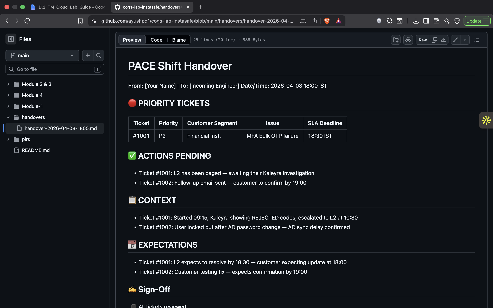
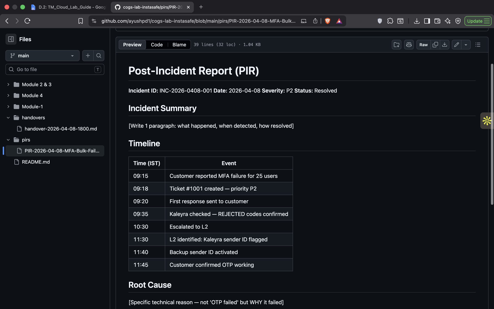

# Lab 5 — PACE Shift Handover and Post-Incident Report (PIR)

## Objective

The objective of this lab was to practice two critical operational responsibilities performed by Support Engineers and Site Reliability Engineers:

1. Creating a structured PACE (Priority, Actions, Context, Expectations) shift handover document.
2. Writing a detailed Post-Incident Report (PIR) after resolving a production incident.

These activities ensure continuity across support shifts and help organizations learn from incidents through documented root cause analysis and preventive actions.

---

## Environment

- GitHub Repository
- Git Version Control
- Markdown Documentation
- Incident Management Workflow

Repository:

`cogs-lab-portfolio`

---

# Step 1 — PACE Shift Handover

A structured shift handover document was created and committed to GitHub.

File Created:

```text
handovers/handover-2026-04-08-1800.md
```

The handover followed the PACE format and included:

## Priority Tickets

Documented active incidents with:

- Ticket number
- Priority
- Customer segment
- Issue summary
- SLA deadline

## Actions Pending

Listed all ongoing activities requiring follow-up by the incoming engineer.

## Context

Provided investigation history and troubleshooting progress for active tickets.

## Expectations

Outlined anticipated outcomes, customer commitments, and expected updates.

## Sign-Off Checklist

Included verification steps to ensure complete knowledge transfer between engineers.

### Evidence



---

# Step 2 — Post-Incident Report (PIR)

A full PIR was created for the MFA Bulk OTP Failure incident.

File Created:

```text
pirs/PIR-2026-04-08-MFA-Bulk-Failure.md
```

The report included all required sections.

---

## Incident Summary

The incident involved a bulk MFA SMS OTP delivery failure affecting 25 users in the finance department of a mid-sized financial institution.

The issue was first reported at 09:15 IST when users were unable to receive SMS OTPs while email OTP delivery continued functioning normally.

Investigation revealed widespread SMS delivery rejections from the SMS gateway provider. After escalation to L2 Support, the sender ID route was identified as blocked. A backup sender ID was activated and service was restored. Customer validation confirmed successful OTP delivery by 11:45 IST.

---

## Timeline

The PIR contained a detailed event timeline documenting:

| Time | Activity |
|--------|----------|
| 09:15 | Customer reported MFA failure |
| 09:18 | P2 ticket created |
| 09:20 | Initial response sent |
| 09:35 | SMS delivery investigation started |
| 10:30 | Escalated to L2 |
| 11:30 | Root cause identified |
| 11:40 | Backup sender activated |
| 11:45 | Customer confirmed resolution |

---

## Root Cause Analysis

### Technical Root Cause

The Kaleyra SMS sender ID used for OTP delivery had been flagged by TRAI due to a DND violation associated with another sender utilizing the same routing infrastructure.

As a result, carrier networks rejected SMS delivery requests, causing OTP messages to fail before reaching end users.

This was confirmed through Kaleyra delivery logs showing REJECTED status codes across all affected users.

---

## Impact Assessment

### Users Affected

- 25 users

### Duration

- Approximately 2 hours and 30 minutes

### Business Impact

- Finance department users could not complete MFA authentication.
- Access to internal business applications was delayed.
- User productivity was impacted during the incident window.

---

## Resolution Steps

1. Investigated SMS gateway delivery failures through Kaleyra logs.
2. Verified affected users and confirmed a common failure pattern.
3. Escalated incident to L2 Support.
4. Identified sender ID routing block.
5. Switched OTP delivery to a backup sender ID.
6. Performed delivery validation testing.
7. Obtained customer confirmation before closure.

---

## Prevention Actions

### Action 1

**Implement Sender ID Health Monitoring**

- Owner: Messaging Operations Team
- Due Date: 2026-04-15

Description:

Create automated alerts for abnormal SMS rejection rates and sender ID delivery failures.

### Action 2

**Introduce Automatic Sender Failover**

- Owner: MFA Platform Team
- Due Date: 2026-04-22

Description:

Implement automatic failover to backup sender IDs whenever rejection thresholds are exceeded.

---

## Open Items

### Knowledge Base Documentation

- Owner: Support Engineering Team
- Due Date: 2026-04-18

Description:

Create a troubleshooting guide for diagnosing SMS OTP delivery failures and sender ID issues.

---

## Evidence

### PACE Handover Commit


---

### PIR Commit



---

# Findings

## Importance of Shift Handovers

A structured handover ensures:

- Continuity between shifts
- Reduced information loss
- Better SLA compliance
- Faster incident resolution

Without proper handovers, critical context can be lost and customer updates may be delayed.

---

## Importance of Post-Incident Reports

PIRs help organizations:

- Understand technical root causes
- Identify process gaps
- Improve operational maturity
- Prevent repeat incidents

They convert incident experience into organizational knowledge.

---

## Key Learning

The most effective incident reports focus on:

- Specific technical causes
- Measurable impact
- Clear remediation actions
- Preventive improvements

rather than simply documenting symptoms.

---

# Conclusion

This lab demonstrated the operational practices used by Support Engineers and Site Reliability Engineers to maintain service continuity and improve incident response quality.

By creating both a structured PACE handover and a detailed Post-Incident Report, the exercise reinforced the importance of communication, documentation, root cause analysis, and preventive action planning within modern support and reliability teams.
