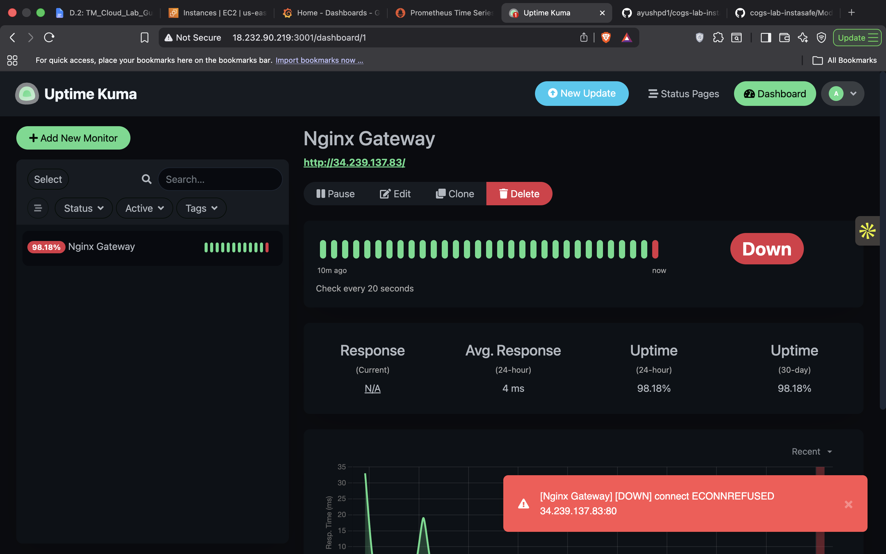
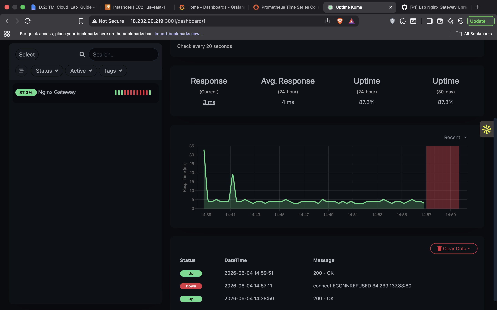

# 🚨 Module 5 – Full Incident Simulation (P1)

## Lab 5.1 — Kill the Gateway — Simulate and Respond to a P1

### Objective
Simulate a Priority 1 (P1) outage by stopping the Nginx gateway service, detect the incident through monitoring, execute the incident response process, restore service, and complete all required documentation.

---

## Environment

### VM1
- Public IP: 34.239.137.83
- Private IP: 172.31.41.183
- Ubuntu 26.04 LTS
- Services:
  - Nginx
  - Prometheus
  - Grafana
  - Node Exporter

### VM2
- Public IP: 18.232.90.219
- Private IP: 172.31.34.35
- Ubuntu 26.04 LTS
- Services:
  - Uptime Kuma

---

## Incident Summary

A simulated outage was triggered by stopping the Nginx service on VM1.

Monitoring detected the outage, a P1 incident ticket was created, investigation was performed using Uptime Kuma and Prometheus, the service was restored, and recovery was verified.

---

## Timeline

| Time | Action |
|--------|---------|
| T+00 | Nginx service stopped |
| T+00 | Uptime Kuma detected outage |
| T+02 | P1 ticket created |
| T+03 | Customer acknowledgement posted |
| T+05 | Investigation started |
| T+10 | Investigation findings documented |
| T+15 | Status update posted |
| T+20 | Nginx restarted |
| T+22 | Recovery verified |
| T+25 | Resolution notice posted |
| T+30 | Ticket closed |
| T+35 | PIR completed |
| T+45 | PACE handover completed |

---

## Monitoring Evidence

### Grafana Dashboard


### Prometheus Monitoring


### Uptime Kuma Dashboard


### Incident Detection (Red Alert)



### Service Recovery



---

## Incident Ticket

GitHub Repository:

https://github.com/ayushpd1/cogs-lab-tickets

Issue Title:

```text
[P1] Lab Nginx Gateway Unreachable — All Users Offline
```

---

## Investigation Findings

### Uptime Kuma

- Alert generated immediately after Nginx service stoppage.
- Outage timestamp recorded in monitoring timeline.

### Prometheus

- No abnormal CPU utilization detected.
- No abnormal memory utilization detected.
- Infrastructure remained healthy.
- Root cause isolated to Nginx service availability.

---

## Root Cause

The Nginx gateway service was intentionally stopped as part of the incident simulation, resulting in service unavailability.

---

## Resolution

Service was restored by restarting Nginx:

```bash
sudo systemctl start nginx
```

Recovery was verified through:

- Uptime Kuma status returning to green
- Nginx service active status
- Successful monitoring checks

---

## Prevention Actions

1. Maintain continuous uptime monitoring using Uptime Kuma.
2. Follow documented operational runbooks for rapid service recovery.
3. Verify critical services after maintenance activities.
4. Continue infrastructure monitoring through Prometheus and Grafana.

---

## Deliverables

- P1 Incident Ticket
- Customer Acknowledgement
- Investigation Notes
- Resolution Notice
- PIR Document
- PACE Handover
- Monitoring Evidence Screenshots

---

## Status

✅ Incident Detected

✅ Ticket Created

✅ Investigation Completed

✅ Service Restored

✅ Recovery Verified

✅ PIR Completed

✅ PACE Handover Completed

✅ Lab Successfully Completed
