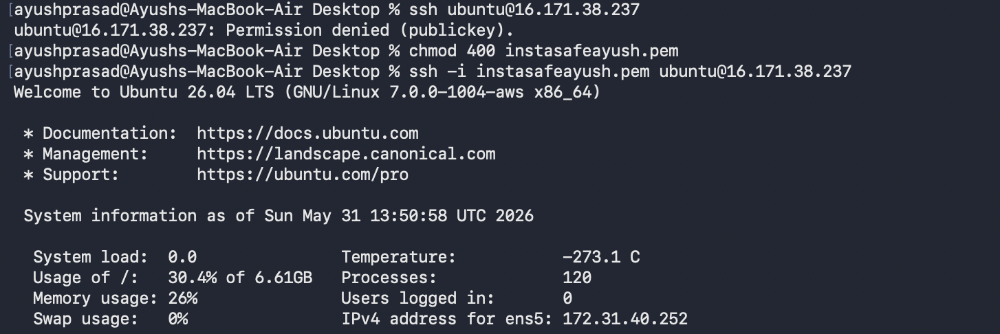
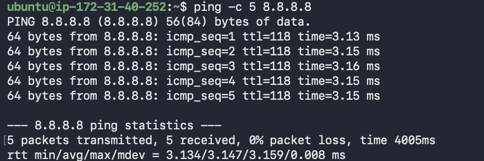
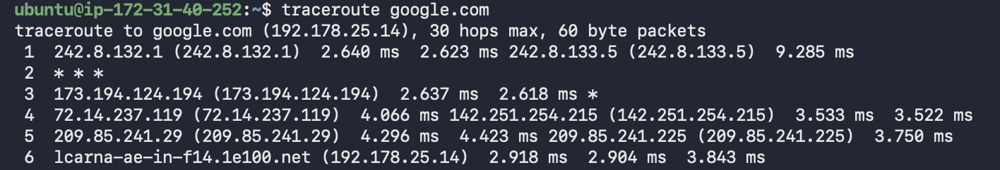
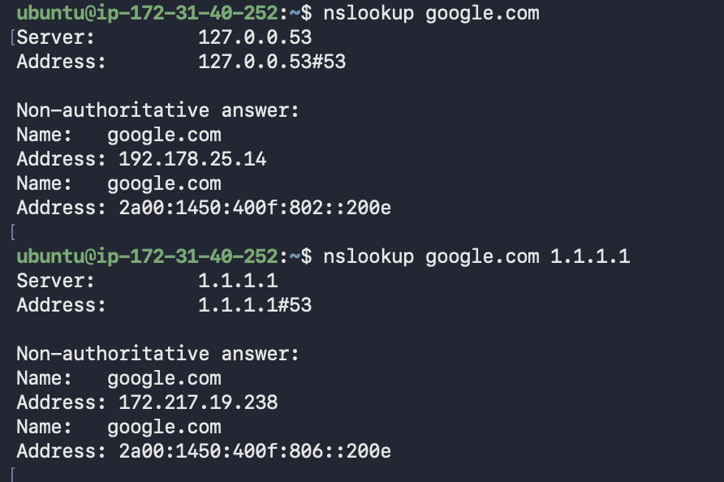
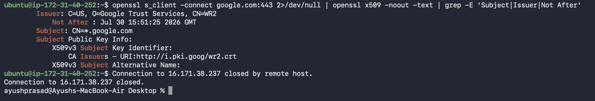

# Lab 1.1 Findings

## My VM Details
- Provider: AWS
- Region: eu-north-1 (Stockholm)
- OS: Ubuntu 26.04 LTS 

**SSH Connection Proof:**

---

## Experiment Results

### Ping to 8.8.8.8

- Average RTT: 3.147 ms
- TTL value observed: 118
- What does TTL tell us about the path?
  TTL (Time To Live) is a mechanism that prevents data packets from circulating infinitely in a network. Every time a packet passes through a router (a "hop"), the TTL value decreases by 1. Observing a TTL of 118 implies that the packet's starting TTL was likely 128 (a standard default), meaning the response packet passed through 10 routing hops to reach the VM (128 - 118 = 10). 

### Traceroute to google.com

- Number of hops: 6
- Any * * * hops? At which hop number?
  Yes, timeouts (`* * *`) were observed at Hop 2 during the standard ICMP traceroute. During the TCP traceroute on port 443, timeouts were observed at Hops 2 and 3. This indicates firewalls or routers at those specific nodes are configured to drop or ignore ICMP echo requests/custom TCP probes, even though they still forward the actual traffic.

### DNS Comparison

- Result from default DNS: 192.178.25.14
- Result from 1.1.1.1: 172.217.19.238
- Are they different? Why might they differ?
  Yes, they are different. This happens because massive global services like Google use GeoDNS and Anycast routing. When querying the default AWS DNS versus Cloudflare's (1.1.1.1), the requests originate from different network paths. Google's authoritative DNS servers analyze where the query is coming from and return the IP address of the data center that is geographically or topologically closest to that specific resolver, optimizing for speed and load balancing.

### google.com TLS Certificate

- Issuer: C=US, O=Google Trust Services, CN=WR2
- Expiry date: Jul 30 15:51:25 2026 GMT
- TLS version used: TLSv1.3
