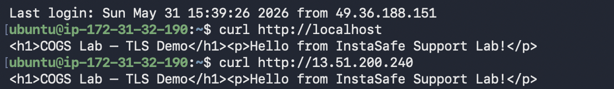
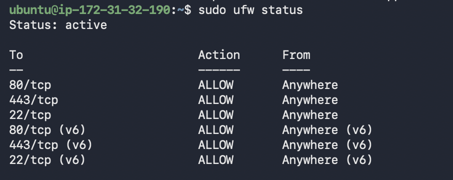
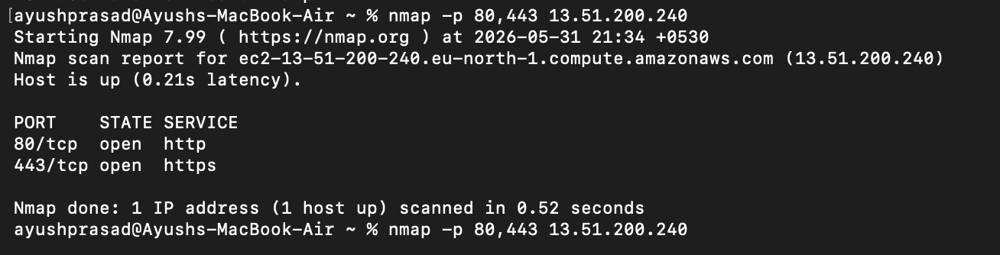
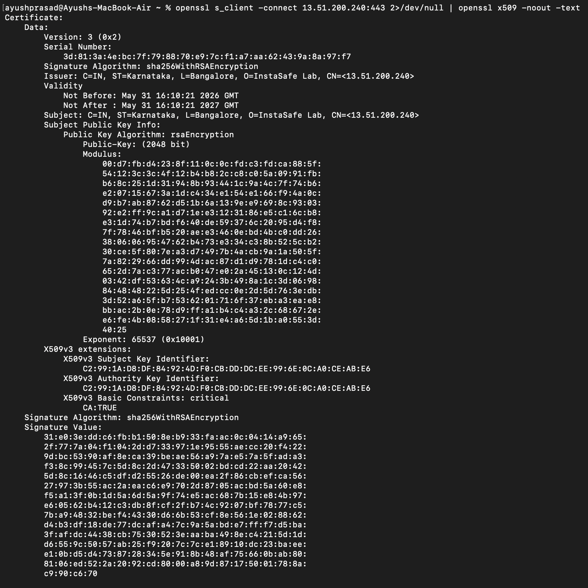

# Lab 1.2 Nginx Setup & Findings: Certificate Analysis
**Author:** Ayush Prasad  
**Target System:** `13.51.200.240` (Ubuntu VM)  
**Date:** May 31, 2026

---

## 1. Nginx Serving HTTP and HTTPS
Nginx was successfully configured to serve both unencrypted HTTP and encrypted HTTPS traffic. The custom HTML page renders correctly over both protocols.
* **Evidence:** 

## 2. Firewall Configuration
The firewall (UFW) was configured to allow web traffic, which was verified externally using `nmap` from a local machine showing ports 80 and 443 as successfully open.
* **UFW Status Evidence:** 
* **Nmap Port Scan Evidence:** 

## 3. TLS Certificate Details
A self-signed X.509 certificate was generated to enable encrypted routing. The extracted cryptographic details via `openssl` are as follows:
* **Subject:** `C=IN, ST=Karnataka, L=Bangalore, O=InstaSafe Lab, CN=<13.51.200.240>`
* **Issuer:** `C=IN, ST=Karnataka, L=Bangalore, O=InstaSafe Lab, CN=<13.51.200.240>`
* **Key Algorithm:** `rsaEncryption` (2048 bit)
* **Expiry Date:** `Not After : May 31 16:10:21 2027 GMT`
* **Evidence:** 

## 4. Analysis: Client Validation Behavior

### Why does `curl` without `-k` fail?
When executing `curl https://13.51.200.240` without the `-k` flag, it fails with an SSL certificate validation error (`SSL certificate problem: self signed certificate`). 

This happens because the certificate was generated locally using OpenSSL rather than being cryptographically signed by a globally recognized Certificate Authority (CA) like Let's Encrypt or DigiCert. When the client initiates the TLS handshake, it cannot verify the server's identity against its local trusted root store. To protect against potential Man-in-the-Middle (MITM) attacks, the client aggressively rejects the connection.

### What would need to change to make it succeed?
To make `curl` (and standard web browsers) trust the connection automatically without bypass flags, one of two things must happen:
1. **Public Trust:** The self-signed certificate must be replaced with one issued by a trusted Root CA. This typically requires mapping a valid Fully Qualified Domain Name (FQDN) to the VM's IP address.
2. **Local Trust:** The `selfsigned.crt` public key must be manually imported into the client machine's trusted Root Certificate Authorities store, explicitly telling the operating system to trust this specific issuer.
