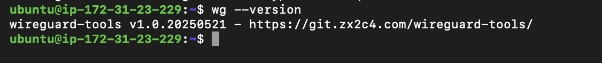
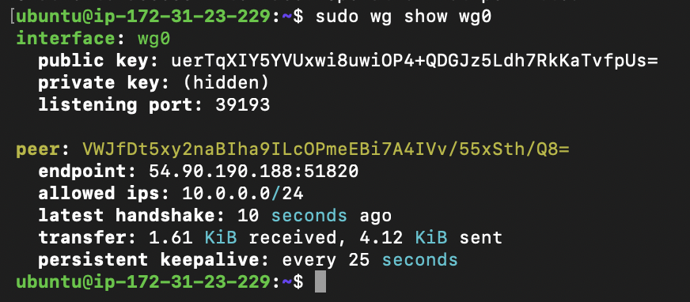
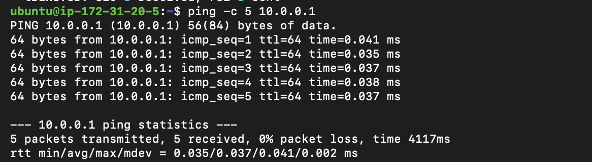
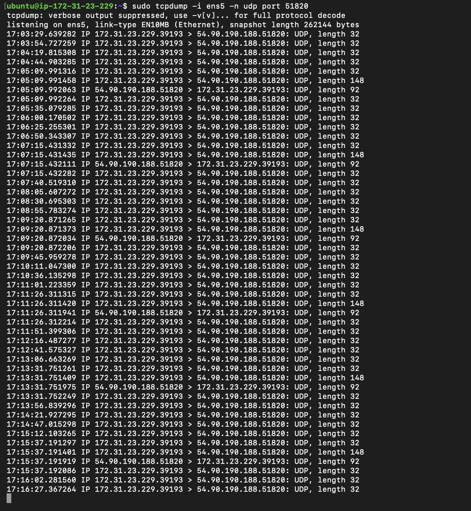

# Lab 1.3 Findings – WireGuard Site-to-Site VPN & ZTNA Component Mapping

**Author:** Ayush Prasad  
**Date:** May 31, 2026  
**Environment:** AWS EC2 (Ubuntu 22.04 LTS)

---

# Evidence 1: WireGuard Running on Both VMs

## VM1 (Gateway) – `wg show wg0`

The output shows an active WireGuard interface with a recent peer handshake, confirming successful tunnel establishment.

---

## VM2 (Agent) – `wg show`

The output shows the client successfully connected to the server with an active handshake and traffic exchange.

---

# Evidence 2: Successful Ping Through the Tunnel

To verify connectivity through the encrypted WireGuard tunnel, VM2 (10.0.0.2) pinged VM1 (10.0.0.1).

### Result

The ping completed successfully with **0% packet loss**, confirming that traffic is correctly routed through the WireGuard tunnel.

---

# Evidence 3: Encrypted Traffic Verification Using tcpdump

A packet capture was performed on the external network interface while traffic traversed the VPN tunnel.

### Result

The packet capture shows only encrypted UDP packets between the two public endpoints. Internal VPN addresses and ICMP payloads are not visible, demonstrating that traffic is encrypted before transmission across the network.

---

# Evidence 4: WireGuard → InstaSafe ZTNA Component Mapping

| WireGuard Component | InstaSafe ZTNA Component | Explanation |
|--------------------|--------------------------|-------------|
| WireGuard Client (VM2) | Agent | Installed on the endpoint device and initiates secure connections to protected resources. |
| WireGuard Server (VM1) | Gateway | Receives secure connections and provides controlled access to internal resources. |
| WireGuard Key Pair (Public/Private Keys) | Certificates / Identity Verification | Used to establish trust and authenticate communicating entities. |
| WireGuard Tunnel | Secure Access Tunnel | Provides encrypted communication between the endpoint and gateway. |
| WireGuard Configuration & AllowedIPs | Controller Policies | Defines which resources are accessible through the tunnel. |

## Explanation

### WireGuard Client → InstaSafe Agent

The WireGuard client running on VM2 behaves similarly to the InstaSafe Agent. It establishes a secure connection and routes approved traffic through the encrypted tunnel.

### WireGuard Server → InstaSafe Gateway

The WireGuard server running on VM1 acts like the InstaSafe Gateway, receiving secure connections and enforcing access to protected resources.

### WireGuard Keys → Certificates

WireGuard authenticates peers using public/private key pairs. InstaSafe uses certificates and identity services to establish similar cryptographic trust.

### WireGuard Configuration → Controller

WireGuard requires manual peer configuration and policy definitions. In InstaSafe, a centralized Controller manages identities, policies, and access permissions.

### WireGuard Tunnel → Secure Access Tunnel

The encrypted WireGuard tunnel represents the secure communication channel used by ZTNA solutions to connect users to authorized resources.

---

# Conclusion

The WireGuard VPN was successfully configured between two AWS EC2 instances. Active handshakes were verified on both systems, tunnel connectivity was confirmed through successful ping tests, and encrypted traffic was validated using packet capture analysis. The exercise also demonstrated how WireGuard components map to core InstaSafe ZTNA architecture elements including the Agent, Gateway, Controller, Certificates, and Secure Access Tunnel.
