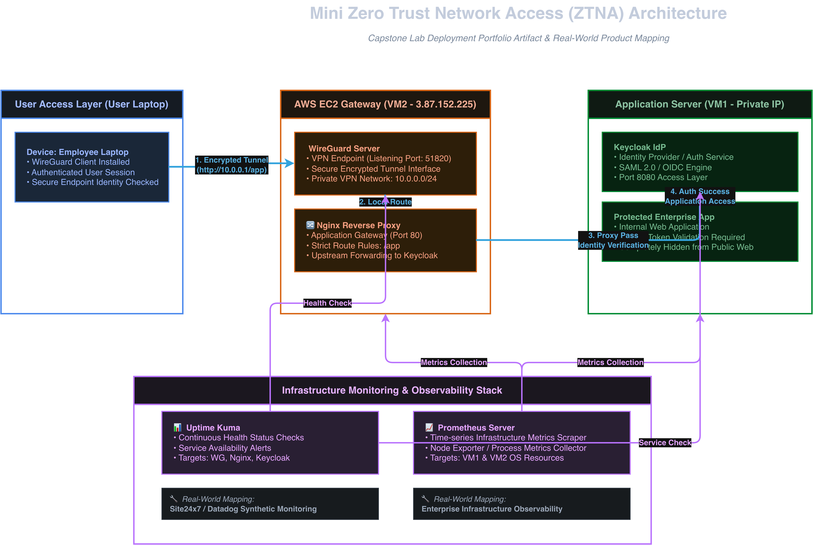
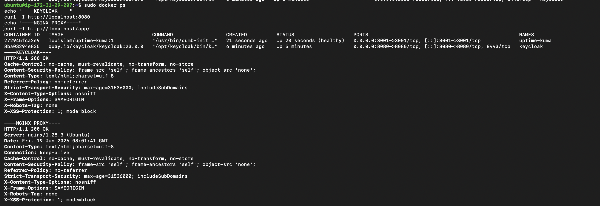

# 💎 Capstone Lab – Mini Zero Trust Network Access (ZTNA) Architecture

## Student Details
- Name: Ayush Prasad
- Program: COGS Cloud Lab
- Capstone: Mini ZTNA Architecture

---

# Architecture Diagram

---

# Evidence

## Evidence 1 – Keycloak Running in Docker

The Keycloak Identity Provider was deployed using Docker and exposed on port 8080.

---

# Architecture Overview

This capstone demonstrates a simplified Zero Trust Network Access (ZTNA) architecture using open-source components.

## Components Used

### User Device
- Employee laptop
- Accesses internal applications through a secure tunnel

### WireGuard
- Provides encrypted connectivity
- Simulates the secure access agent used in enterprise ZTNA products

### Nginx Reverse Proxy
- Acts as the application gateway
- Receives incoming requests and forwards them to the protected application

### Keycloak
- Functions as the Identity Provider (IdP)
- Handles authentication and identity verification
- Supports modern authentication protocols

### Protected Application
- Internal web application hosted behind the gateway
- Accessible only through the defined access path

---

# Traffic Flow

1. User initiates a connection from their laptop.
2. Traffic enters the secure WireGuard tunnel.
3. Requests reach the gateway layer running Nginx.
4. Nginx forwards application requests to Keycloak and the protected application.
5. Identity verification is performed.
6. Authenticated users receive access to the application.

This creates a simplified implementation of the Zero Trust principle: verify identity before granting access to resources.

---

# Written Reflection

## How does this mini-ZTNA map to the real InstaSafe product?

This capstone project represents a simplified version of the architecture used by modern Zero Trust Network Access solutions such as InstaSafe. Although the deployment is small and designed for learning purposes, the major building blocks closely resemble those found in enterprise-grade ZTNA platforms.

WireGuard serves as the secure connectivity layer in this implementation. In the real InstaSafe platform, secure agents and encrypted tunnels are used to establish trusted communication between users and organizational resources. The purpose remains the same: users should not directly access internal applications over the public internet. Instead, all traffic travels through a secure and controlled channel.

Nginx acts as the application gateway. This is conceptually similar to the InstaSafe Gateway component, which receives user requests and determines how traffic should be routed. Gateways are an important part of Zero Trust architectures because they provide a centralized enforcement point for security and access policies.

Keycloak functions as the Identity Provider. In production environments, organizations often use providers such as Microsoft Azure Active Directory, Okta, Google Workspace, or other enterprise identity systems. The objective is identical: verify the user's identity before granting access to protected applications.

The protected application behind the gateway represents an internal business application. In real deployments, this could be an ERP system, CRM platform, internal dashboard, database management console, development environment, or any other business-critical service.

Overall, the capstone demonstrates the core Zero Trust principle of "never trust, always verify." Access decisions are based on identity and controlled pathways rather than simple network location.

## What is missing compared to a production deployment?

While the architecture successfully demonstrates ZTNA concepts, several production-grade capabilities are absent.

First, there is no high availability. Enterprise deployments typically include multiple gateways, load balancers, failover mechanisms, and redundant infrastructure to eliminate single points of failure.

Second, advanced access policies are missing. Production systems enforce granular controls based on user groups, device posture, risk scores, geolocation, application sensitivity, and compliance requirements.

Third, comprehensive monitoring and logging are not fully implemented. Real deployments integrate with SIEM platforms, audit logging systems, and security analytics tools for threat detection and compliance reporting.

Fourth, endpoint security validation is not present. Modern Zero Trust platforms verify device health, operating system status, antivirus presence, and security posture before granting access.

Finally, production environments use TLS certificates, secure secrets management, automated backups, disaster recovery plans, centralized policy engines, and continuous monitoring. These features are essential for large-scale enterprise adoption but were intentionally omitted from this educational deployment to keep the architecture simple and understandable.

Despite these limitations, the capstone successfully demonstrates the fundamental concepts behind a modern Zero Trust Network Access platform and provides a practical understanding of how identity, secure connectivity, and application gateways work together to protect organizational resources.

---
